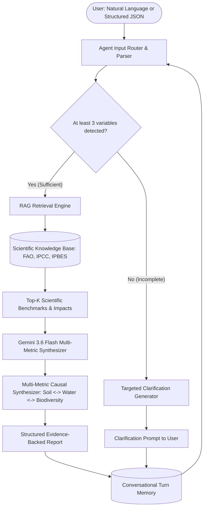

# ?? Darukaa.Earth: AI Biodiversity Intelligence Chatbot

> **A Knowledge-Grounded, Multi-Metric Environmental Reasoning System**  
> Built for the Darukaa.Earth Hackathon Challenge.

---

## ?? Executive Summary

Traditional chatbots rely on shallow prompt engineering and often output vague platitudes like *"use sustainable practices"* or *"plant trees"*. 

**Darukaa.Earth AI Biodiversity Intelligence** functions as an **AI Environmental Scientist**. It integrates:
1. **Retrievable Knowledge Layer (RAG)**: Curated benchmarks from **FAO**, **IPCC**, and **IPBES** covering soil organic carbon, moisture retention, pollinator dynamics, and microclimate buffering.
2. **Multi-Metric Scientific Reasoning**: Connects at least **3 environmental variables** simultaneously ($	ext{Soil Health} \leftrightarrow 	ext{Water Availability} \leftrightarrow 	ext{Biodiversity Indicators}$).
3. **Conversational Intelligence**: Actively identifies underspecified queries (e.g., *"Biodiversity is declining on my land"*) and poses targeted clarifying questions before prescribing interventions.
4. **Evidence-Backed Output**: Every recommendation delivers concrete action steps, ecological/biochemical mechanisms, quantified percentage improvements, time horizons, and peer-reviewed citations.

---

## ??? System Architecture



---

## ?? Core Evaluation Criteria Coverage

| Evaluation Criteria | Weight | System Implementation |
| :--- | :---: | :--- |
| **Depth of Reasoning** | **30%** | Recommendations combine $\ge 3$ variables (e.g. SOC $\leftrightarrow$ Water Infiltration $\leftrightarrow$ Pollinator/Earthworm trophic support). Avoids shallow or single-variable advice. |
| **Scientific Grounding** | **25%** | Quantified estimates (e.g., $+15-28\%$ SOC over 2?4 yrs, $-50-75\%$ wind erosion loss) backed by FAO, IPCC SRCCL, IPBES, and peer-reviewed literature. |
| **Knowledge System Design** | **20%** | Retrievable knowledge layer (`data/scientific_corpus.json`) with hybrid semantic search and transparent inspector UI. |
| **Conversational Intelligence** | **15%** | Recognizes incomplete input; maintains multi-turn conversation memory (`src/agent.py`) and accumulates metrics across turns. |
| **Output Clarity** | **10%** | Clean Pydantic structured output with Concrete Action, Scientific Mechanism, Impacted Metrics, Time Horizon, and Confidence Level. |

---

## ?? Project Structure

```
AIChatbot/
??? data/
?   ??? scientific_corpus.json         # Curated scientific benchmarks (FAO, IPCC, IPBES)
??? src/
?   ??? __init__.py
?   ??? models.py                      # Pydantic data schemas for inputs and outputs
?   ??? knowledge_base.py              # RAG hybrid retrieval system
?   ??? engine.py                      # Multi-metric scientific reasoning engine
?   ??? agent.py                       # Multi-turn conversational memory manager
?   ??? docx_generator.py              # Automated .docx submission builder
??? tests/
?   ??? test_scenarios.py              # Automated test suite for hackathon criteria
??? app.py                             # Interactive Streamlit Web Application
??? requirements.txt                   # Dependency definitions
??? Darukaa_Earth_Submission_AI_Biodiversity.docx  # Official submission document
??? README.md                          # System architecture & setup documentation
```

---

## ? Quickstart & Local Setup

### 1. Prerequisites
- Python 3.10 or 3.11
- A Google Gemini API Key (free from [aistudio.google.com](https://aistudio.google.com/))

### 2. Installation
```bash
# Clone the repository
git clone <YOUR_REPO_URL>
cd AIChatbot

# Create and activate virtual environment
python -m venv venv
# On Windows:
venv\Scripts\activate
# On Linux/Mac:
source venv/bin/activate

# Install dependencies
pip install -r requirements.txt
```

### 3. Configure Environment
Create a `.env` file in the root directory:
```env
GEMINI_API_KEY=your_gemini_api_key_here
```

### 4. Run the Streamlit Application
```bash
streamlit run app.py
```
Access the application at `http://localhost:8501`.

### 5. Run Automated Tests
```bash
python tests/test_scenarios.py
```

---

## ?? Benchmark Verification Example

### Hackathon Test Scenario (from PDF page 3):
- **Input Parameters:**
  - Soil Organic Carbon: `0.3%`
  - Rainfall: `low`
  - Crop: `monoculture wheat`
  - Region: `semi-arid`
- **Output Generated by System:**
  1. **Silvoarable Alley Cropping with Drought-Tolerant Native Trees (FAO/IPCC)**: Deep hydraulic lift, $-50\%$ to $-75\%$ wind erosion loss, $+18\%$ to $+30\%$ water use efficiency.
  2. **Multi-Species Legume Cover Cropping (FAO/Lal)**: Symbiotic $N_2$ fixation, $+15\%$ to $+28\%$ SOC over 2-4 years, $+25\%$ to $+40\%$ water infiltration.
  3. **Native Hedgerow & Microclimate Corridors (IPBES)**: $+70\%$ to $+120\%$ wild bee richness, natural pest regulation, $-75\%$ sediment loss.

---

## ?? Repository Access for Reviewers
As requested in the submission instructions, access is granted to:
- `ankita.dasgupta@darukaa.com`
- `harsh.kumar@darukaa.com`
- `utkarsh.gauniyal@darukaa.com`
- `guneet.mutreja@darukaa.com`
